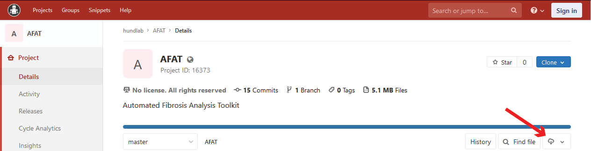
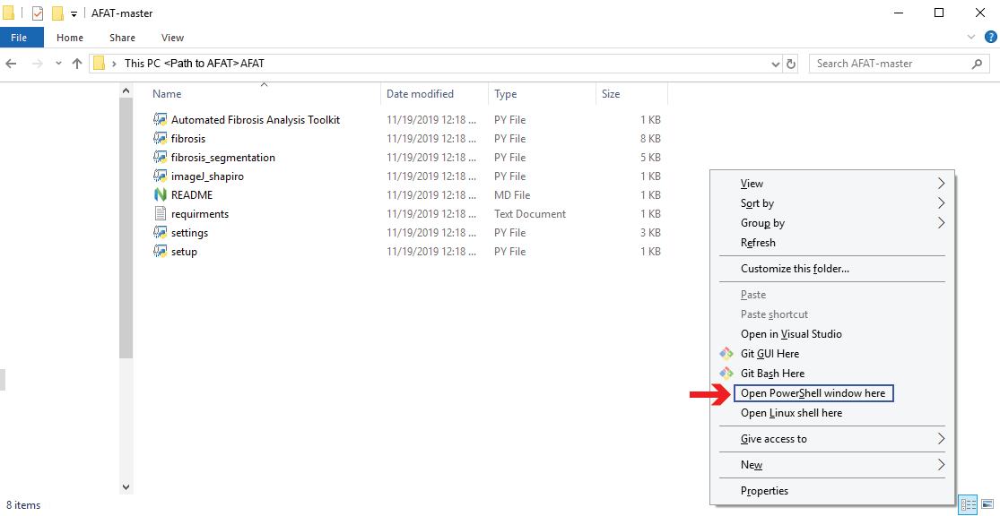
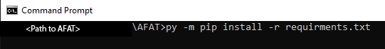

# Automated Fibrosis Analysis Toolkit (AFAT)
## Setup
### Windows
1. Python 3.7.5 will need to be installed prior to setting up AFAT. Python 3.7.5 can be 
    downloaded from python.org. The x86-64 executable installer is reccommended,
    as the default install configuration will set python to open .py files by 
    double clicking. If it is installed correctly opening a cmd or powershell 
    window and typing `py` and pressing enter should start a python prompt.
    
2. Download AFAT either by using git to clone the repository, or with the download button.
    Be sure to download all files.
    
3. Open a terminal window in the folder where AFAT has been downloaded.
    This can also be achieved by opening the AFAT folder in File Explorer,
    Right Clicking + Shift, and selecting 'Open Powershell here' or 'Open 
    Command Prompt here'.
    
4.  From the prompt window, to install the dependencies run the command 
    `py -m pip install -r requirements.txt`. Alternatively install these 
    dependencies: matplotlib, scipy, numpy, scikit-image, scikit-learn, Tkinter.
    
5. To run AFAT either double-click on *Automated Fibrosis Analysis Toolkit.py* from
    the file explorer or open the command prompt/powershell as directed in (3) and
    run `py 'Automated Fibrosis Analysis Toolkit.py'`.

*Note that it may take a few seconds for AFAT to start.*

### Mac/Linux
1. Python 3 will need to be installed prior to setting up AFAT. Python 3 can be 
    installed via your package manager in linux, or downloaded from python.org for mac.
    If it is installed correctly opening a terminal and typing python (in some 
    distributions such as Ubuntu the command is python3) should start a python prompt.
2. From a terminal window navigate to the folder where AFAT has been downloaded. 
    From there run the command `pip install -r requirements.txt`. Alternatively 
    install these dependencies: matplotlib, scipy, numpy, scikit-image, scikit-learn,
    Tkinter.
3. To run MAT either use the command `python 'Automated Fibrosis Analysis Toolkit.py'` or
    double-click on *Automated Fibrosis Analysis Toolkit.py* from the file explorer.
